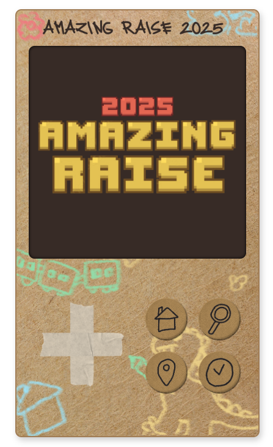
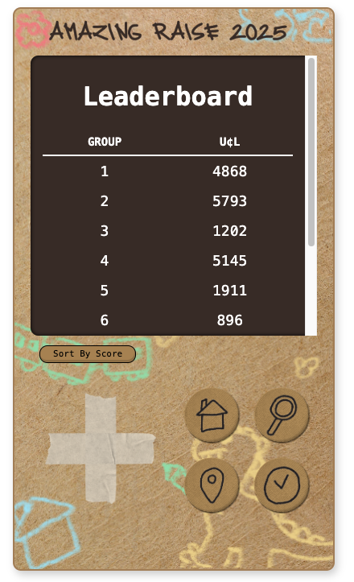

# GameSheet

A Gameboy-styled web interface that displays live data from a Google Sheets backend, supporting a fundraising event with 100+ participants.

## Preview

|  |  |
| :-----------------------------------------: | :-----------------------------------------: |

## Features

- 🎮 Retro Game Boy-inspired UI design
- 📊 Real-time leaderboard with sorting functionality
- 📱 Responsive navigation system
- 🔄 Loading animations
- 📈 Google Sheets integration for dynamic data

## Technical Stack

- **Frontend**: HTML, CSS, JavaScript
- **Backend**: Google Sheets API
- **Dependencies**: Google API Client Library (gapi)

## Setup

1. Set up environment variables for your Google Sheets API credentials:

   - Create a `.env` file in your project root
   - Add the following variables:

   ```
   GSHEET_API_KEY=your-api-key
   GSHEET_ID=your-sheet-id
   ```

   - Make sure to add `.env` to your `.gitignore` file

2. The server endpoint in api folder will automatically use these environment variables to provide the configuration to the frontend securely.

3. Host the files on a web server or use a local development
